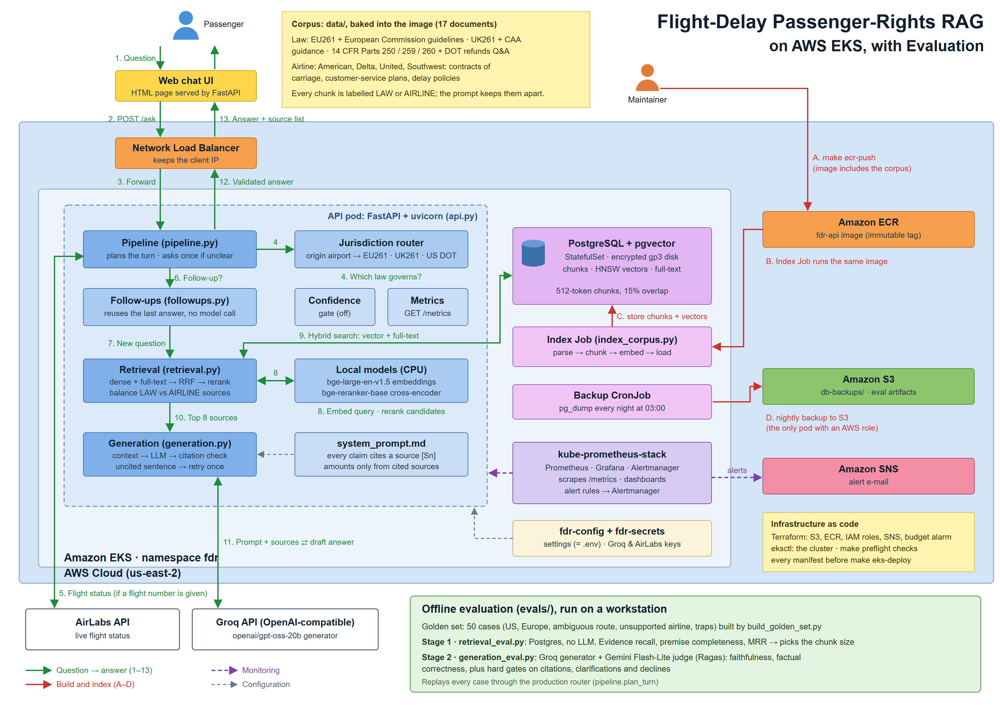

# Flight Delay RAG

> Active project: the core system is built, evaluated and has been deployed on AWS. Feedback welcome.

Your flight is delayed four hours. Are you owed $600, $520, a refund, a hotel, or nothing?Most passengers don’t know, because the answer can depend on where the flight departed, which airline operated it, and whether the airline’s own contract promises more than the law requires.

Flight Delay RAG is a chatbot came in my mind when my flight was delayed for 6 hours but I had to make it to the first day of class. That's been already over a year, I didn't know RAG then, AWS was just a buzzword to me. Now that i have started exploring world of platform Engineering, was like yeah..why not? Long story short my projec combines live flight status(AirLabsAPI) with text retrieved from government regulations (US DOT / 14 CFR, EU261, UK261) and
airline policies (American, Delta, United, Southwest). Every factual sentence in an answer
cites its source. I focused primarily on US domestic and Europe bound operations of these 4 carries.

### What I had to get right

-**he route decides the law, so code decides the route, not the LLM.** U261 and UK261 bind a
  US airline only when the flight *departs* the EU or UK. London → New York can owe up to £520;
  New York → London owes no fixed compensation. Getting that wrong is the most expensive mistake
  the bot can make, so jurisdiction is resolved deterministically from the departure airport,
  and the governing law gets a guaranteed place in the model's context.
-**overnmnet law and airline promises are kept apart.** regulations say what a passenger is *entitled*
  to; contracts of carriage say what the airline *promised*. Retrieval
  reserves slots for both, and every source is labelled LAW or AIRLINE in the prompt.
-**Ask, never guess.** If a question leaves out the detail that decides which law applies
  ("my flight was delayed 5 hours"), the bot asks one clarifying question, then answers on a
  stated assumption.
-**No uncited claims** A validator checks every sentence: a legal, money or deadline claim
  without a valid citation is sent back for one retry, and withheld if it still fails. No answer
  is better than a confident wrong one about money someone is owed.

## Demo

<!-- Replace docs/demo.gif with the recorded demo. The image will show as broken until the file exists. -->
<p align="center">
  
</p>

## High-Level Architecture

<!-- Replace docs/architecture.png with the final architecture diagram. -->
<p align="center">
  
</p>

---

## Table of Contents

- [Overview](#overview)
- [Features](#features)
- [Scope](#scope)
- [Tech Stack](#tech-stack)
- [How It Works](#how-it-works)
- [Repository Structure](#repository-structure)
- [Getting Started](#getting-started)
  - [Prerequisites](#prerequisites)
  - [Configuration](#configuration)
  - [Run Locally](#run-locally)
  - [Run with Docker Compose](#run-with-docker-compose)
- [Corpus](#corpus)
- [Evaluation](#evaluation)
- [Monitoring](#monitoring)
- [Deployment on AWS](#deployment-on-aws)
- [Testing](#testing)
- [Limitations](#limitations)

---

## Overview

After a disruption, a passenger's rights depend on two things they rarely know: **which law
governs their flight** (decided by the departure airport for these US carriers) and **what their
airline promised** on top of that law. This chatbot works out the governing regime from the
route, retrieves the relevant regulation and airline text, and answers with the two kept apart:
what the law *entitles* you to, and what the carrier *promised*.

## Features

- **Live flight lookup** — a flight number is resolved through AirLabs, and the real route and
  delay decide which rules apply.
- **Jurisdiction routing** — a pure-function applicability matrix selects the governing regime
  (US DOT, EU261, UK261) from the origin and destination.
- **Clarify once, then answer** — if the route is unclear, the bot asks one round of questions,
  then answers on a stated assumption.
- **Hybrid retrieval** — dense (pgvector) + PostgreSQL full-text search, a cross-encoder
  reranker, and source balancing so both law and airline policy reach the context.
- **Citation-checked answers** — every factual sentence must cite a retrieved source; answers
  that fail validation are retried or withheld.
- **Follow-up answers** — common follow-ups ("I want a refund instead") are answered from the
  previous validated answer without another model call.
- **Observability** — Prometheus metrics, alert rules and a Grafana dashboard.

## Scope

| | |
|---|---|
| **Airlines** | American (AA), Delta (DL), United (UA), Southwest (WN) |
| **Flights** | US domestic, plus these carriers' Europe operations |
| **Jurisdictions** | US (DOT / 14 CFR), EU (EU261), UK (UK261) |

| Route | Governing law |
|---|---|
| UK → US | UK261 + US DOT |
| EU → US | EU261 + US DOT |
| UK → EU | UK261 only |
| EU → UK | EU261 only |
| US → UK / EU / US | US DOT only |
| Other → US | Nothing established; US DOT *may* apply, and the passenger is referred to the departure country's authority |

## Tech Stack

| Layer | Technology |
|---|---|
| API | FastAPI |
| Vector store | PostgreSQL + pgvector |
| Embeddings | `bge-large-en-v1.5` |
| Reranker | `bge-reranker-base` (RRF-fused with the dense rank) |
| Generator | Any OpenAI-compatible API (currently Groq `openai/gpt-oss-20b`) |
| Flight data | AirLabs API |
| Evaluation | Custom retrieval metrics + Ragas |
| Monitoring | Prometheus, Grafana |
| Deployment | Docker Compose, AWS EKS, Terraform |

## How It Works

1. **Route** — the question (and live flight data, if a flight number is given) is parsed for
   carrier, airports and disruption; the applicability matrix picks the governing and in-scope
   regimes.
2. **Retrieve** — a structured search query runs dense and full-text search over the permitted
   documents; remedy, scope and trigger lanes add targeted candidates.
3. **Rerank and balance** — the cross-encoder reorders candidates; quotas reserve seats for
   government and airline sources, and the governing regime's text is guaranteed a slot.
4. **Generate** — the model answers from the labelled sources under one system prompt
   (`system_prompt.md`).
5. **Validate** — each sentence is checked for a valid `[Sn]` citation; failures are retried
   with the exact rejected sentences quoted back.

## Repository Structure

```text
.
├── src/flight_delay/        # Application code
│   ├── api.py               # FastAPI app and web UI
│   ├── pipeline.py          # Turn planning, retrieval query, lanes, answer flow
│   ├── jurisdiction.py      # Route parsing and the applicability matrix
│   ├── retrieval.py         # Hybrid search, reranking, source balancing, context
│   ├── generation.py        # LLM client, prompt, citation validation
│   ├── followups.py         # Follow-up answers from conversation state
│   ├── ingest.py            # PDF / Markdown / text parsing and chunking
│   ├── store.py             # Postgres + pgvector store
│   ├── tools.py             # AirLabs flight lookup
│   └── metrics.py           # Prometheus metrics
├── data/                    # Corpus: regulations, airline contracts, airport regions
├── scripts/                 # Indexing, preflight checks, local run helpers
├── evals/                   # Golden set, retrieval (Stage 1) and generation (Stage 2) evals
├── tests/                   # Pytest suite
├── deploy/                  # Prometheus, Grafana, Kubernetes, Helm, Terraform
├── docs/                    # README images (demo GIF, architecture diagram)
├── system_prompt.md         # The single system prompt
├── Dockerfile
├── docker-compose.yml
├── Makefile
├── RESULTS.md               # Evaluation results
├── RUNBOOK.md               # Local runbook
└── RUNBOOK_AWS.md           # AWS deployment runbook
```

## Getting Started

### Prerequisites

- Python 3.11+ and [uv](https://github.com/astral-sh/uv)
- Docker (for Postgres and the container stack)
- An AirLabs API key and an OpenAI-compatible LLM endpoint
- Optional: a CUDA GPU for faster embedding

### Configuration

All settings live in a single `.env` file at the repository root (not committed). It holds the
database DSN, the LLM endpoint and model, the AirLabs key and the context-window settings.

### Run Locally

```bash
make install        # core dependencies
make install-ml     # embedder + reranker
make db             # start Postgres
make index          # parse, embed and load the corpus
make run            # start the API on http://localhost:8000
```

### Run with Docker Compose

```bash
make up                 # postgres + api + prometheus + grafana
make index-container    # build the index inside the api image
```

## Corpus

17 documents in `data/`, indexed as 512-token chunks with 15% overlap:

- **Government:** EU261 and the European Commission's interpretative guidelines, UK261 and the
  UK CAA guidance, 14 CFR Parts 250, 259 and 260 and the DOT refunds Q&A.
- **Airline:** contracts of carriage, customer service plans and delay policies for American,
  Delta, United and Southwest.

Each document's type, jurisdiction, airline and source URL are declared in the manifest in
`scripts/index_corpus.py`.

## Evaluation

Evaluation runs against a 50-case golden set (`evals/golden_set.jsonl`) in two stages:

| Stage | Script | Measures |
|---|---|---|
| 1. Retrieval | `evals/retrieval_eval.py` | Premise completeness, primary-authority coverage, evidence recall, MRR |
| 2. Generation | `evals/generation_eval.py` | Faithfulness, factual correctness, citation, clarification and abstention gates |

See [RESULTS.md](RESULTS.md) for the measured numbers.

## Monitoring

The API exports Prometheus metrics (`src/flight_delay/metrics.py`). Alert rules live in
`deploy/prometheus/rules/rag.yml` and the default Grafana dashboard in
`deploy/grafana/dashboards/rag.json`. Both are provisioned by Docker Compose.

## Deployment on AWS

```text
Developer laptop (Git Bash)
   │
   ├── terraform apply ──► S3 bucket        (eval artifacts, db-backups/)
   │                       ECR repository   fdr-api
   │                       IAM policies     fdr-db-backup, fdr-alerts-publish
   │                       SNS topic        fdr-alerts ──► email
   │                       Budget alarm     fdr-monthly
   │
   ├── docker build + push ──► Amazon ECR (immutable image tag)
   │
   ├── eksctl ──► EKS cluster "fdr" (Kubernetes 1.35)
   │                ├── 2 × m7i-flex.large worker nodes
   │                ├── add-ons: vpc-cni, coredns, kube-proxy, EBS CSI
   │                └── IRSA: fdr-backup, fdr-alertmanager, aws-load-balancer-controller
   │
   ├── helm ──► AWS Load Balancer Controller
   ├── helm ──► kube-prometheus-stack (Prometheus, Grafana, Alertmanager)
   │
   └── kubectl apply deploy/k8s/  (namespace, gp3 StorageClass, NetworkPolicies,
                                   fdr-config ConfigMap, fdr-secrets Secret)

Kubernetes workloads (namespace fdr)

   Index Job ──writes──► PostgreSQL + pgvector ◄──reads── API pods × 2 ──► Groq (LLM)
                         (StatefulSet, gp3 EBS)               │        └──► AirLabs (flights)
                                   │                          │
                                   ▼                          ▲
                         db-backup CronJob (03:00)         AWS NLB ◄── Public URL
                         pg_dump ──► S3 db-backups/

Monitoring

   Prometheus ──scrapes──► API /metrics
       ├──► Grafana dashboards
       └──► Alertmanager ──► SNS fdr-alerts ──► email
```

Full step-by-step procedure: [AWS_deployment.md](AWS_deployment.md).

## Testing

```bash
make test    # pytest
make lint    # ruff
```

## Limitations

- Covers four US carriers and three jurisdictions only.
- Routes departing outside the US, EU and UK are referred to the relevant authority, not answered.
- Generation results are provisional until the full 50-case Stage 2 run completes.
- This assistant gives information, not legal advice, and cannot book or change flights.
